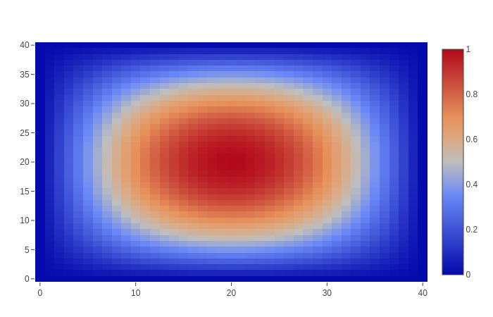
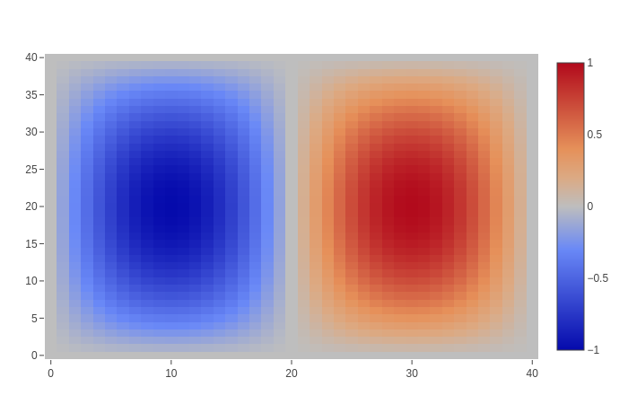
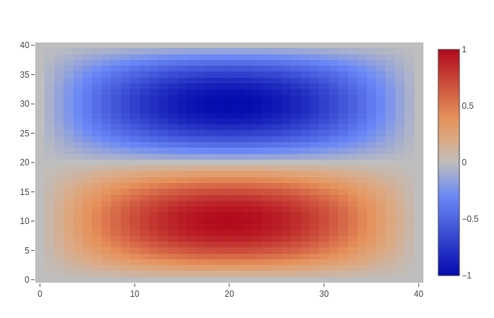
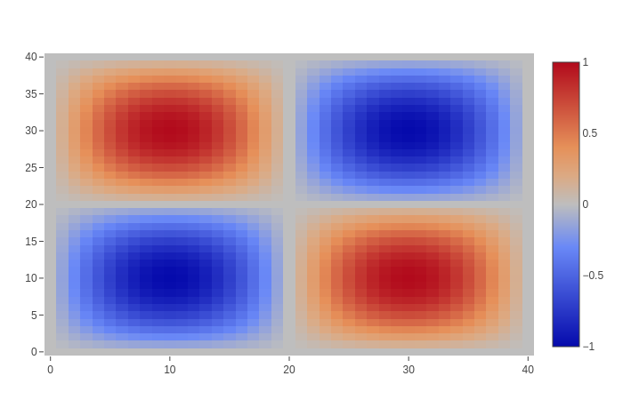

# DiscreteExteriorCalculus.jl

[travis-img]: https://travis-ci.com/rigetti/DiscreteExteriorCalculus.jl.svg?branch=master
[travis-url]: https://travis-ci.com/rigetti/DiscreteExteriorCalculus.jl
[codecov-img]: https://codecov.io/gh/rigetti/DiscreteExteriorCalculus.jl/branch/master/graph/badge.svg
[codecov-url]: https://codecov.io/gh/rigetti/DiscreteExteriorCalculus.jl

[![][travis-img]][travis-url]
[![][codecov-img]][codecov-url]

DiscreteExteriorCalculus.jl is a package implementing [Discrete Exterior Calculus](https://en.wikipedia.org/wiki/Discrete_exterior_calculus). Data structures for cell complexes, primal, and dual meshes are provided along with implementations of the [exterior derivative](https://en.wikipedia.org/wiki/Exterior_derivative),
[hodge star](https://en.wikipedia.org/wiki/Hodge_star_operator), [codifferential](https://en.wikipedia.org/wiki/Hodge_star_operator#On_manifolds), and [Laplace-de Rham](https://en.wikipedia.org/wiki/Laplace%E2%80%93Beltrami_operator#Laplace%E2%80%93de_Rham_operator) operators.

## Installation

Clone the repository from GitHub and install Julia 1.1. No build is required beyond the default Julia compilation.

## Example usage: modes of the Laplace-de Rham operator on a rectangle with Dirichlet boundary conditions

See `test/test_laplacian_rectangle.jl` for a more complete version of this example. Also see [DiscretePDEs.jl](https://github.com/rigetti/DiscretePDEs.jl) for more examples.

Import packages.
```julia
using DiscreteExteriorCalculus
const DEC = DiscreteExteriorCalculus
using LinearAlgebra: eigen
using AdmittanceModels: sparse_nullbasis
using Base.Iterators: product
using PlotlyJS: plot, heatmap
```

Create a rectangular grid that is r1×r2, then subdivide each rectangle into two triangles. Collect these into a cell complex.
```julia
r1, r2 = .5, .4
num = 40
points, tcomp = DEC.triangulated_lattice([r1, 0], [0, r2], num, num)
```

Orient the cell complex positively and compute the dual mesh.
```julia
orient!(tcomp.complex)
m = Metric(2)
mesh = Mesh(tcomp, circumcenter(m))
```

Compute the Laplace-de Rham operator for 0-forms and a sparse nullbasis for the constraint that the 0-form goes to 0 on the boundary.
```julia
laplacian = differential_operator(m, mesh, "Δ", 1, true)
comp = tcomp.complex
_, exterior = boundary_components_connected(comp)
constraint = zero_constraint(comp, exterior.cells[1], 1)
nullbasis = sparse_nullbasis(constraint)
```

Compute the eigenvalues and eigenvectors of the restricted Laplace-de Rham operator.
```julia
vals, vects = eigen(collect(transpose(nullbasis) * laplacian * nullbasis))
inds = sortperm(vals)
vals, vects = vals[inds], vects[:, inds]
```

Lift the eigenvectors back to the original space and reshape for plotting.
```julia
comp_points = [c.points[1] for c in comp.cells[1]]
ordering = [findfirst(isequal(p), comp_points) for p in points]
vs = [collect(transpose(reshape((nullbasis * vects[:,i])[ordering],
    num+1, num+1))) for i in 1:size(vects, 2)]
for i in 1:length(vs)
    j = argmax(abs.(vs[i]))
    vs[i] /= vs[i][j]
end
```

Plot the first eigenvector.
```julia
plot(heatmap(z=vs[1]))
```



Plot the second eigenvector.
```julia
plot(heatmap(z=vs[2]))
```



Plot the third eigenvector.
```julia
plot(heatmap(z=vs[3]))
```



Plot the fourth eigenvector.
```julia
plot(heatmap(z=vs[4]))
```



And so on.
